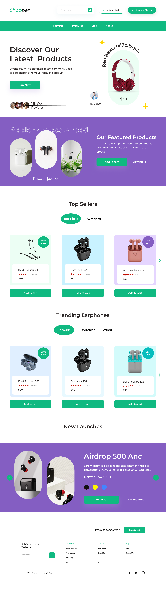

# 🛍️ Shopper — Stylish E-commerce Landing Page

**Shopper** — це сучасна, естетично приваблива лендинг-сторінка для онлайн-магазину, яка поєднує в собі динамічний інтерфейс, інтерактивні елементи та плавну навігацію. Вона ідеально підходить для демонстрації електроніки, аксесуарів або будь-яких товарів, які потребують візуального акценту.

---

## 🔧 Основні функції

- **Інтерактивний хедер:** логотип, пошук товарів, кнопки входу та кошика.
- **Головний банер:** заклик до покупки, відео-презентація продукту, відгуки користувачів.
- **SVG-анімація назви продукту по кривій:** унікальний візуальний ефект.
- **Секція "Featured Products":** демонстрація популярних товарів з діями.
- **Таби з категоріями:** перемикання між "Top Picks" і "Watches".
- **Swiper-слайдери:** плавна навігація між товарами в кожному табі.
- **Одна пара стрілок для всіх слайдерів:** динамічне перепризначення навігації.
- **Секція "New Launches":** нові продукти з вибором кольору, описом і кастомними стрілками.
- **Заміна зображень при виборі кольору:** інтерактивна логіка для оновлення фото товару.
- **Система рейтингу:** інтерактивні зірки для оцінки товарів з підсвічуванням при наведенні.
- **Футер з підпискою:** форма email-підписки, багаторівневе меню, соціальні іконки.
- **Мінімалістичний дизайн:** чиста верстка, сучасна типографіка, акцент на продукт.
- **Гнучка стилізація:** використання CSS-змінних для легкого редагування теми.
- **Адаптивна структура:** легко розширюється під мобільні пристрої.
- **CSS Reset:** власний null.css для уніфікації стилів у різних браузерах.

---

## 🧰 Технології

- HTML5 / CSS3
- JavaScript (ES6+)
- Swiper.js
- Google Fonts: Montserrat, DM Sans

---

## 📸 Демо-прев’ю

  
<sub>Головна сторінка з банером, табами, слайдерами, новинками та футером</sub>

🔗 **Live Demo:** [Перейти на сайт](https://your-username.github.io/shopper-ui)

---

## 🚀 Як запустити

```bash
git clone https://github.com/your-username/shopper-ui.git
cd shopper-ui
# Відкрий index.html у браузері
